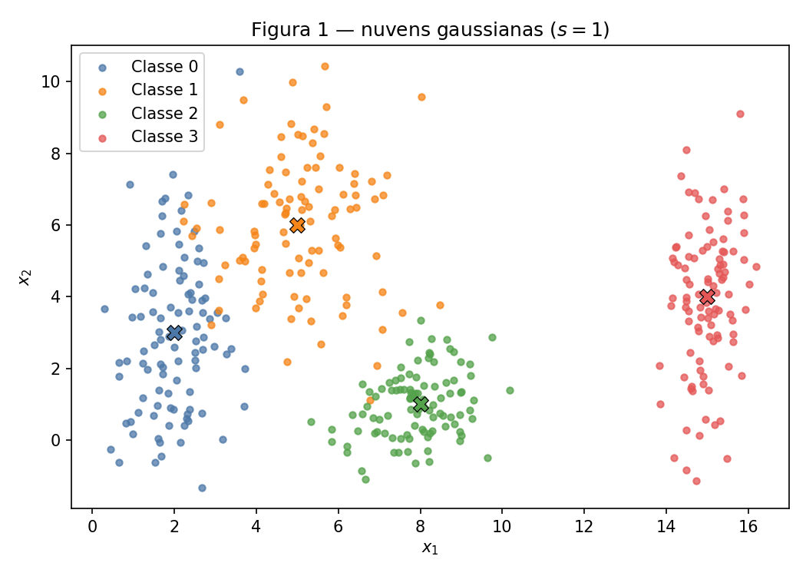
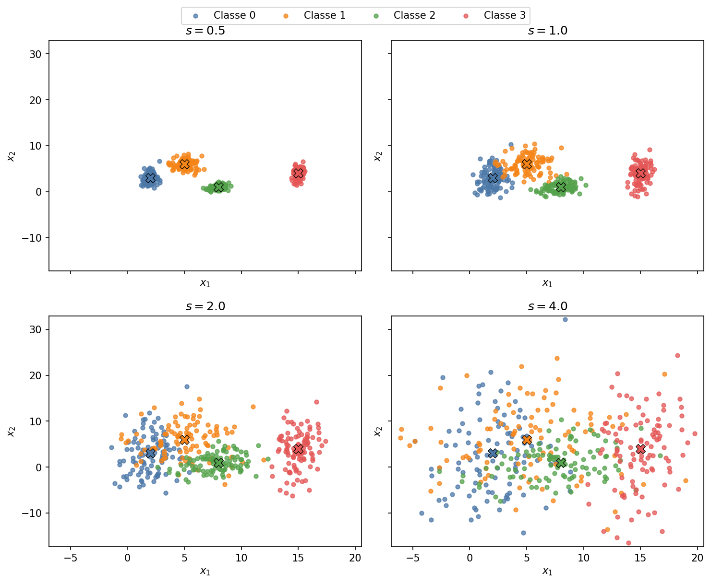
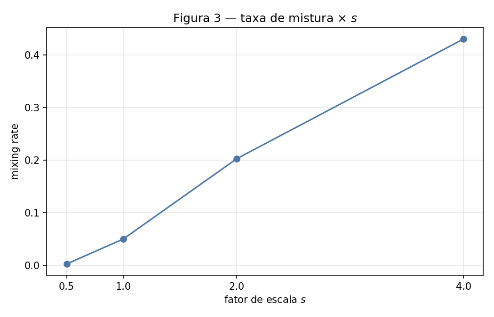
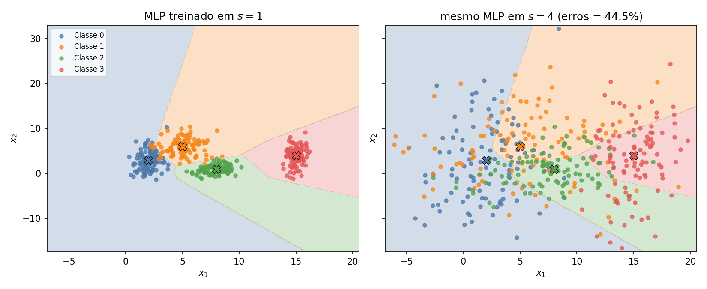
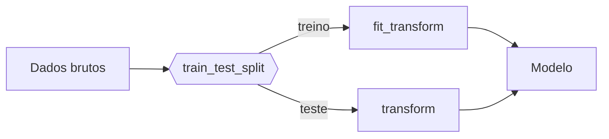

# 1. Data

!!! abstract "Enunciado"

    [Exercises → Data](https://insper.github.io/ann-dl/){:target='_blank'}

## Exercise 1

Quatro gaussianas 2D (100 pontos cada, semente `42`). Os centros $\boldsymbol{\mu}$ ficam
fixos; só o desvio é multiplicado pelo fator $s \in \{0{,}5,\,1,\,2,\,4\}$.
O ruído $\mathcal{N}(0,1)$ é sorteado **uma vez**, para que a comparação entre
escalas não misture efeito de $s$ com amostragem nova.

### A

Cada classe $k$ é amostrada como
$\mathbf{x} = \boldsymbol{\mu}_k + s\,\boldsymbol{\sigma}_k \odot \mathbf{z}$,
$\mathbf{z}\sim\mathcal{N}(\mathbf{0},\mathbf{I})$. Com $s=1$ as nuvens já
mostram geometrias diferentes: a classe 0 é alongada em $x_2$
($\sigma_y=2{,}5$), a 2 é quase isotrópica, a 3 é uma faixa vertical isolada
em $x_1=15$.

``` { .python .copy .select linenums='1' title="docs/exercises/data/code/exercise1_point_clouds.py" }
--8<-- "docs/exercises/data/code/exercise1_point_clouds.py"
```


/// caption
**Figura 1** — 400 pontos ($s=1$). Os $\times$ marcam os centros do enunciado,
não os centróides amostrais.
///

### B

A Figura 2 usa os **mesmos limites de eixo** nos quatro painéis. Com $s=0{,}5$
as nuvens são compactas e quase disjuntas; em $s=4$ elas ocupam o mesmo
retângulo e se atravessam.


/// caption
**Figura 2** — As mesmas quatro classes com $s \in \{0{,}5,\,1,\,2,\,4\}$.
///

O *separation ratio* usa só os parâmetros (médias e desvios do enunciado):

$$
\bar{\sigma}_k = \frac{\sigma_{k,x}+\sigma_{k,y}}{2},\qquad
r_{ij}=\frac{\lVert\boldsymbol{\mu}_i-\boldsymbol{\mu}_j\rVert}{\bar{\sigma}_i+\bar{\sigma}_j}.
$$

Como $\bar{\sigma}_k(s)=s\,\bar{\sigma}_k(1)$ e as médias não mudam,
$r_{ij}(s)=r_{ij}(1)/s$. Não é preciso gerar dados novos para $s=2$.

| Par $(i,j)$ | $\lVert\boldsymbol{\mu}_i-\boldsymbol{\mu}_j\rVert$ | $r_{ij}(s=1)$ | $r_{ij}(s=2)=r/2$ |
|--------------|------------------------------------------|---------------|-------------------|
| (0, 1) | 4.243 | **1.326** | **0.663** |
| (0, 2) | 6.325 | 2.480 | 1.240 |
| (0, 3) | 13.038 | 4.496 | 2.248 |
| (1, 2) | 5.831 | 2.380 | 1.190 |
| (1, 3) | 10.198 | 3.642 | 1.821 |
| (2, 3) | 7.616 | 3.542 | 1.771 |

O par mais misturado é **(0, 1)**. Em $s=2$ esse $r_{01}$ cai para $0{,}663<1$:
a distância entre centros fica menor que a soma das dispersões médias, então
as nuvens se sobrepõem de verdade.

A taxa de mistura compara cada ponto aos **quatro centros do enunciado**
(nenhum treino): é a fração cujo vizinho mais próximo não é o centro da própria
classe.

| $s$ | Mixing rate |
|-----|-------------|
| 0.5 | 0.25% (1 / 400) |
| 1.0 | 5.00% (20 / 400) |
| 2.0 | 20.25% (81 / 400) |
| 4.0 | 43.00% (172 / 400) |


/// caption
**Figura 3** — Mixing rate $\times$ $s$. O salto relevante é de $s=1$ (5%)
para $s=2$ (20%).
///

A partir de **$s=2$** as nuvens deixam de ser separáveis por retas de forma
útil: o menor $r_{ij}$ cruza $1$ e um quinto dos pontos já está mais perto do
centro errado. Em $s=4$ a mistura (43%) é quase o nível de um classificador
aleatório de 4 classes (75% de erro), então fronteiras retas não recuperam
as classes.

### C

**Sobreposição em $s=1$.** A classe 3 ($x_1\approx 15$) está longe das outras
($r_{03}=4{,}50$, $r_{13}=3{,}64$, $r_{23}=3{,}54$). A classe 2 também se
separa bem. O overlap visível é só entre **0 e 1** ($r_{01}=1{,}33$, e a
maioria dos 5% de mistura vem desse par). Uma **única** reta não separa
quatro classes: no máximo parte o plano em dois. Um **conjunto** de retas
(por exemplo um-contra-resto, ou as arestas de Voronoi dos quatro centros)
quase resolve o problema em $s=1$, com erro residual na fronteira 0–1.

**Fronteiras que uma rede aprenderia.** Um MLP ReLU recorta o plano em
polígonos. Treinado em $s=1$ (duas camadas de 16 neurônios), ele aprendeu
regiões adjacentes: classe 0 à esquerda, 1 acima, 2 embaixo à direita, 3 no
canto $x_1$ grande — fronteiras aproximadamente lineares por trecho, como
na Figura 4 (esquerda).


/// caption
**Figura 4** — Esquerda: regiões do MLP treinado em $s=1$ (acurácia 97,5% no
próprio treino). Direita: as mesmas regiões com os pontos de $s=4$ — 44,5% de
erro, concentrado onde as nuvens atravessam a fronteira aprendida.
///

**Ligação com o item B.** Quanto maior $s$, mais pontos da classe $k$ caem
na região que a rede atribuiu à classe $\ell$. A zona de erro inchada é a
vizinhança das fronteiras da Figura 4, sobretudo entre 0 e 1 (menor
$r_{ij}$) e, em $s=4$, também entre 1–2 e 2–3. A rede não “esqueceu” os
centros; o suporte das gaussianas é que invadiu o território das vizinhas.

## Exercise 2

### Abordagem

### Código

### Figuras

### Análise

!!! note "Fronteiras não lineares"

    Para justificar por que as cascas concêntricas exigem fronteira não linear, ajuda
    escrever a condição de decisão. Um separador linear é

    $$
    f(\mathbf{x}) = \mathbf{w}^\top \mathbf{x} + b,
    $$

    enquanto a estrutura das cascas depende de $\lVert \mathbf{x} - \boldsymbol{\mu} \rVert$,
    que não é expressável nessa forma.

## Exercise 3

### Abordagem

### Código

### Figuras

### Análise

!!! warning "Vazamento de dados"

    O `train_test_split` vem **antes** de qualquer imputação, encoding ou escalonamento.
    Ajuste os transformadores só no treino e aplique-os ao teste.



## Results summary

Linhas 1–3 usam o **menor** $r_{ij}$ (par 0–1). As demais entregas ainda não
foram feitas.

| # | Métrica | Valor |
|---|---------|-------|
| 1 | Separation ratio (`scale = 0.5`) | 2.652 ($r_{01}$) |
| 2 | Separation ratio (`scale = 1.0`) | 1.326 ($r_{01}$) |
| 3 | Separation ratio (`scale = 2.0`) | 0.663 ($r_{01}$) |
| 4 | Taxa de mistura (`scale = 1.0`) | 5.00% |
| 5 | Distância entre centros — gaussianas 5D | |
| 6 | Variância explicada — PC1 + PC2 | |
| 7 | Raio médio — casca interna | |
| 8 | Raio médio — casca externa | |
| 9 | Amostras de treino após o split | |
| 10 | Amostras de teste após o split | |
| 11 | Colunas com valores ausentes | |
| 12 | Features após o encoding | |
| 13 | Faixa das features após o escalonamento | |

## Discussão

O ponto fácil de errar é tratar $r_{ij}$ como estatística amostral. O enunciado
define $\boldsymbol{\mu}$ e $\boldsymbol{\sigma}$ pelos parâmetros da gaussiana, então a
razão é determinística e $r(s)=r(1)/s$. A mixing rate, ao contrário, depende
da amostra — por isso o ruído foi congelado entre escalas.

## Conclusão

A complexidade da fronteira não vem só do número de classes: vem de quanto as
nuvens se sobrepõem. Com $s$ pequeno, retas por trecho bastam. Quando $s$
cresce e $r_{ij}$ cai abaixo de 1, qualquer rede erra na faixa entre centros —
não porque o modelo seja fraco, mas porque o próprio rótulo pelo centro mais
próximo já é ambíguo.
