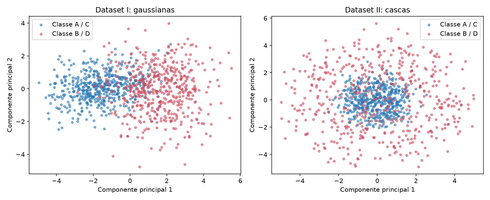
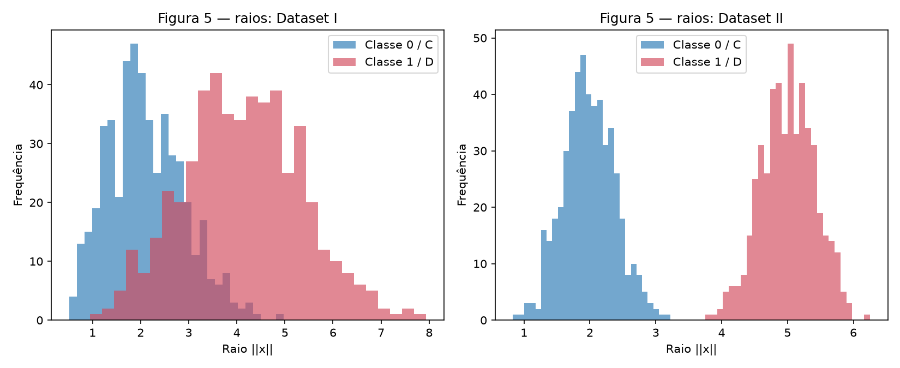

# 1. Data

!!! abstract "Enunciado"

    [Exercises → Data](https://insper.github.io/ann-dl/){:target='_blank'}

Este relatório está em português e mantém a ordem do enunciado. Todos os experimentos
que não dependem de arquivo externo usam `np.random.default_rng(42)`.

## Exercise 1

### A — Generate the clouds

Foram geradas quatro classes gaussianas em duas dimensões, com 100 pontos por classe.
Os centros e desvios são exatamente os do enunciado. O mesmo ruído normal foi reutilizado
para todos os valores de $s$, isolando o efeito da dispersão.

``` { .python .copy .select linenums='1' title="exercise1_point_clouds.py" }
--8<-- "docs/exercises/data/code/exercise1_point_clouds.py"
```


/// caption
**Figura 1** — As quatro classes em $s=1$; os marcadores `X` são os centros definidos
no enunciado.
///

### B — More or less spread out

Os quatro conjuntos foram gerados com $s\in\{0{,}5,1,2,4\}$, mantendo os mesmos
centros e os mesmos ruídos-base. Os eixos da Figura 2 são compartilhados.


/// caption
**Figura 2** — Aumentar $s$ amplia as regiões de sobreposição.
///

Para $\bar\sigma_k=(\sigma_{k,x}+\sigma_{k,y})/2$ e
$r_{ij}=\|\mu_i-\mu_j\|/(\bar\sigma_i+\bar\sigma_j)$, os resultados são:

| Par | Distância entre centros | $r_{ij}(1)$ | $r_{ij}(2)$ |
|---|---:|---:|---:|
| (0, 1) | 4,243 | 1,326 | 0,663 |
| (0, 2) | 6,325 | 2,480 | 1,240 |
| (0, 3) | 13,038 | 4,496 | 2,248 |
| (1, 2) | 5,831 | 2,380 | 1,190 |
| (1, 3) | 10,198 | 3,642 | 1,821 |
| (2, 3) | 7,616 | 3,542 | 1,771 |

O menor valor é o do par $(0,1)$. Como os centros não mudam, $r_{ij}(s)=r_{ij}(1)/s$;
portanto, o menor valor em $s=2$ é $0{,}663$.

| $s$ | Pontos misturados | Mixing rate |
|---:|---:|---:|
| 0,5 | 1/400 | 0,25% |
| 1,0 | 20/400 | 5,00% |
| 2,0 | 81/400 | 20,25% |
| 4,0 | 172/400 | 43,00% |


/// caption
**Figura 3** — A taxa de mistura cresce com a dispersão.
///

### C — Analysis

Em $s=1$, as classes 2 e 3 estão bem afastadas, enquanto a maior sobreposição ocorre
entre as classes 0 e 1. Uma única reta não separa quatro classes; um conjunto de retas,
como as fronteiras da partição de Voronoi dos centros, separa boa parte dos pontos.

A partir de $s=2$, o par $(0,1)$ tem $r<1$ e a taxa de mistura já é 20,25%. Assim,
as nuvens deixam de ser separáveis de forma útil por fronteiras lineares: há pontos de
classes diferentes ocupando a mesma região. Em $s=4$, essa região de ambiguidade cresce
para 43,00% dos pontos.

## Exercise 2

### A — Dataset I: shifted Gaussians

Gerei 500 pontos para cada classe usando as médias e matrizes de covariância fornecidas.
O código completo, incluindo a PCA e os histogramas, está abaixo.

### B — Dataset II: concentric shells

Para cada ponto, gerei um vetor normal em $\mathbb{R}^5$, normalizei sua norma para obter
uma direção uniforme e multipliquei por um raio normal. Os raios médios observados foram
1,984839 para a classe interna e 5,004668 para a classe externa.

### C — Visualize and compare

``` { .python .copy .select linenums='1' title="exercise2_3_analysis.py" }
--8<-- "docs/exercises/data/code/exercise2_3_analysis.py"
```


/// caption
**Figura 4** — Projeções em duas componentes principais.
///


/// caption
**Figura 5** — Histogramas de $\|x\|$ para os dois datasets.
///

No Dataset I, a distância entre os centros amostrais foi **3,228217** e as duas primeiras
componentes preservaram **65,974111%** da variância. No Dataset II, a distância foi apenas
**0,266559**, enquanto a PCA preservou **43,155163%**. A PCA representa melhor a separação
do Dataset I, mas isso não significa que o Dataset II seja inseparável.

### D — Analysis

No Dataset II, os centros coincidem aproximadamente, mas os raios estão separados. Isso
mostra que a informação da classe está na distância à origem, e não em uma direção fixa.
Um hiperplano $w^\top x+b=0$ não consegue separar uma casca interna de uma externa,
porque cada reta que atravessa a casca externa também atravessa a região interna.

Uma projeção PCA misturada não prova que os dados originais sejam inseparáveis: PCA é uma
transformação linear que prioriza variância, não separabilidade. A função
$g(x)=\sum_{k=1}^{5}x_k^2=\|x\|^2$ separa diretamente as classes por um limiar entre os
raios 2 e 5.

## Exercise 3

### A — Get to know the data

O arquivo pedido pelo enunciado é o `train.csv` do Spaceship Titanic. `Transported` indica
se o passageiro foi transportado para outra dimensão. O script calcula o balanceamento,
os valores ausentes e as estatísticas de gastos diretamente a partir desse arquivo.

### B — Split before you transform

O split estratificado 80/20 ocorre antes de imputação, codificação e escalonamento. Assim,
medianas, categorias observadas, médias e desvios usados no treino não incorporam informação
do conjunto de teste.

### C — Preprocess

As colunas categóricas usam imputação pela categoria mais frequente e one-hot encoding com
`handle_unknown="ignore"`. As colunas numéricas usam mediana do treino, `TotalSpend` é a
soma dos cinco gastos, e os gastos recebem $\log(1+x)$ antes da padronização. `Cabin`,
`Name` e `PassengerId` são removidas.

### D — Verify and visualize

O relatório final será completado executando:

```text
python docs/exercises/data/code/exercise2_3_analysis.py --csv caminho/para/train.csv
```

O comando gera a Figura 6, imprime a tabela de ausentes, o balanceamento, o formato final
das matrizes, os intervalos após a padronização e a contagem de `NaN`. O CSV não está neste
repositório e a API do Kaggle exige autenticação; por isso não inventei números para esta
seção.

!!! note "Figura 6"

    A Figura 6 é gerada pelo comando acima assim que o `train.csv` estiver disponível.

## Results summary

| # | Métrica | Resultado |
|---:|---|---:|
| 1 | Mixing rate em $s=0,5$ | 0,25% |
| 2 | Mixing rate em $s=1$ | 5,00% |
| 3 | Mixing rate em $s=2$ | 20,25% |
| 4 | Mixing rate em $s=4$ | 43,00% |
| 5 | Menor $r_{ij}$ e par | 1,326 em $(0,1)$; em $s=2$: 0,663 |
| 6 | Distância entre centros — Dataset I | 3,228217 |
| 7 | Distância entre centros — Dataset II | 0,266559 |
| 8 | PC1 + PC2 — Dataset I | 65,974111% |
| 9 | PC1 + PC2 — Dataset II | 43,155163% |
| 10 | Classe positiva em `Transported` | Executar com `train.csv` |
| 11 | Média e mediana de `FoodCourt` no treino | Executar com `train.csv` |
| 12 | Forma final da matriz de treino | Executar com `train.csv` |
| 13 | Mínimo e máximo após escalonamento | Executar com `train.csv` |
