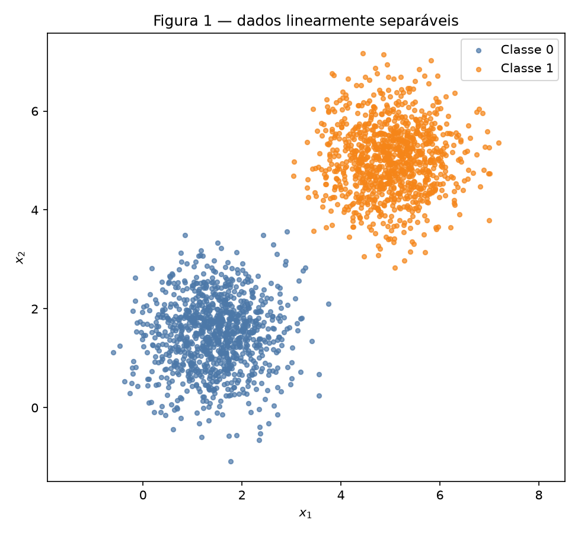
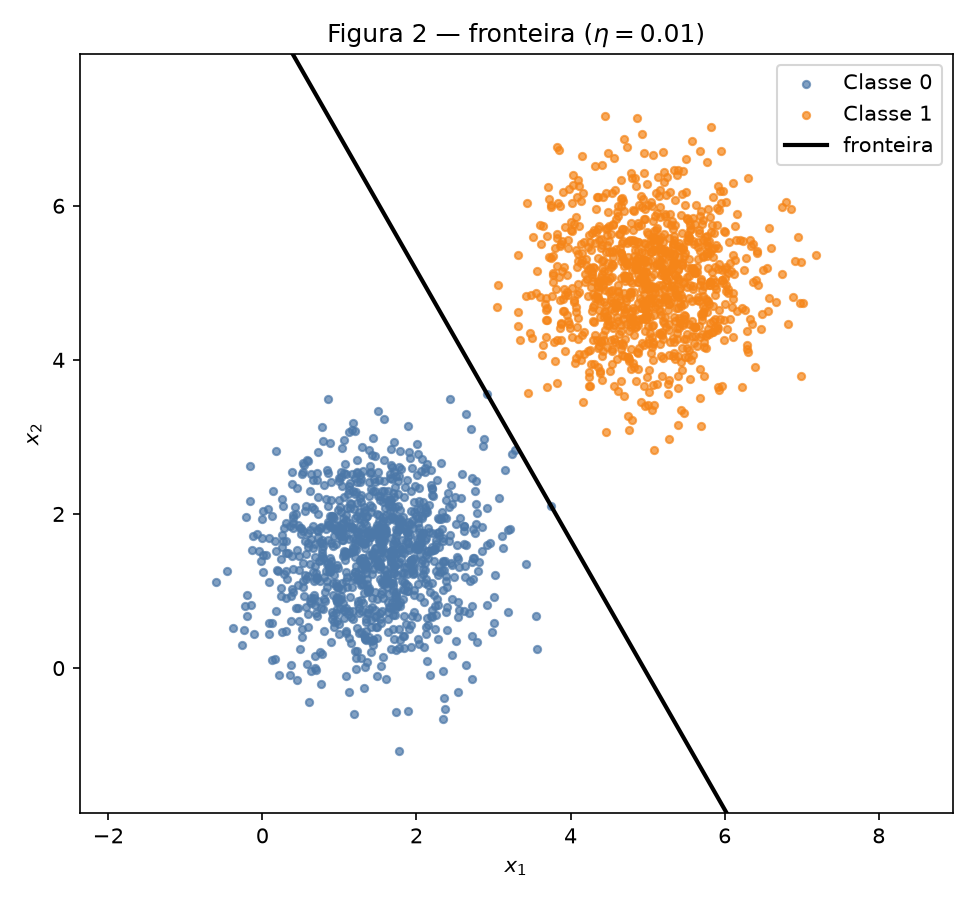
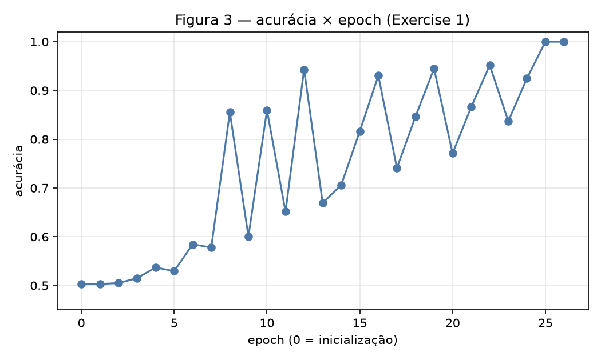
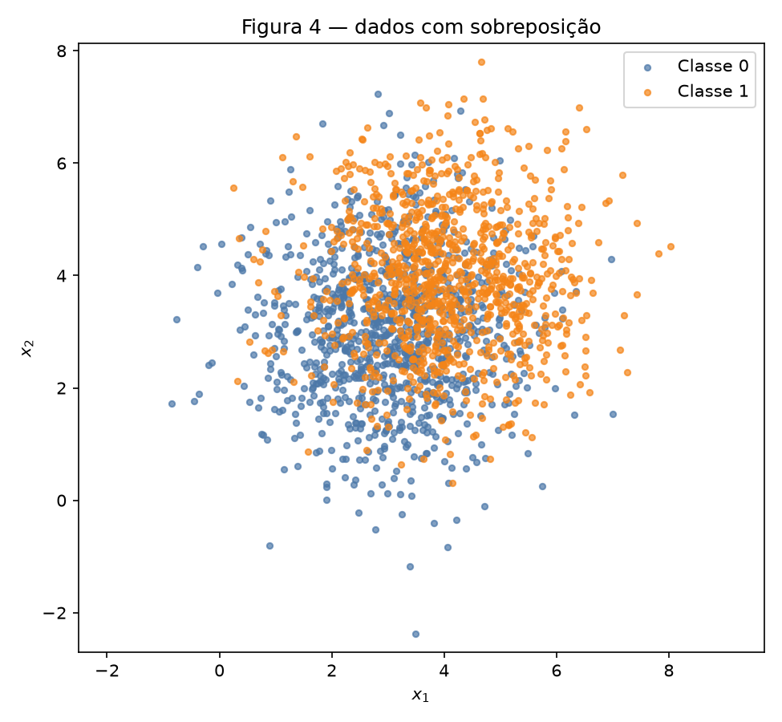
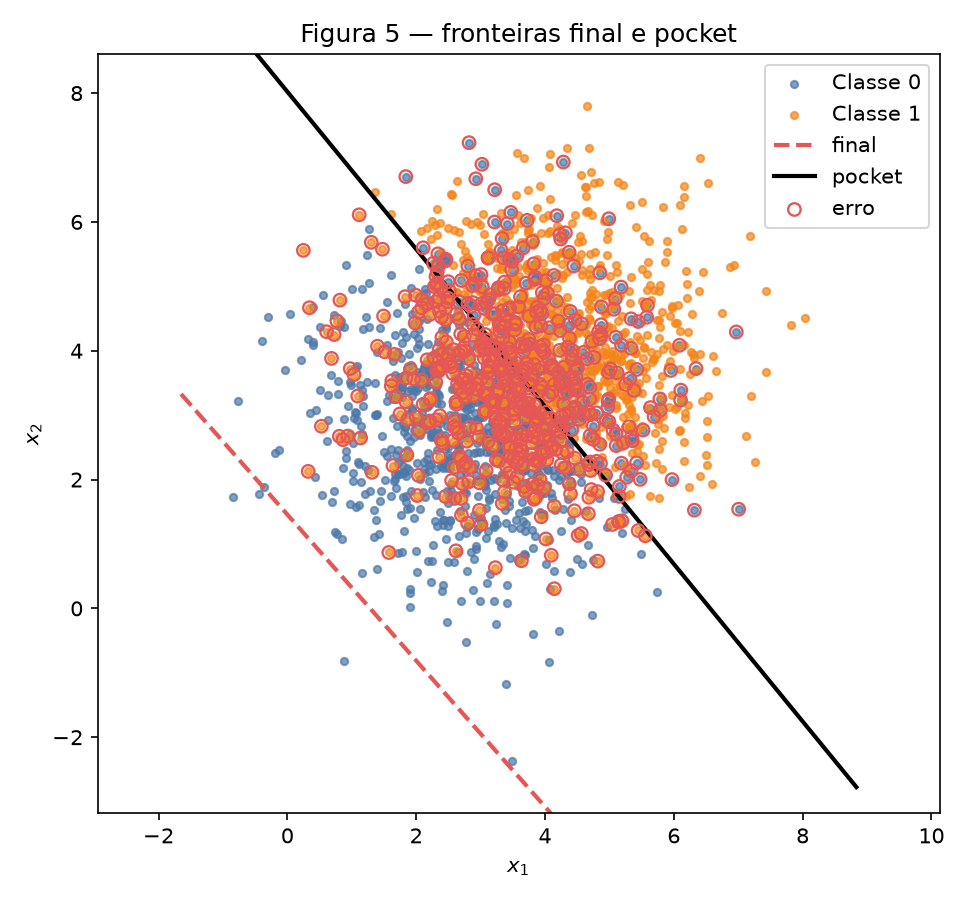
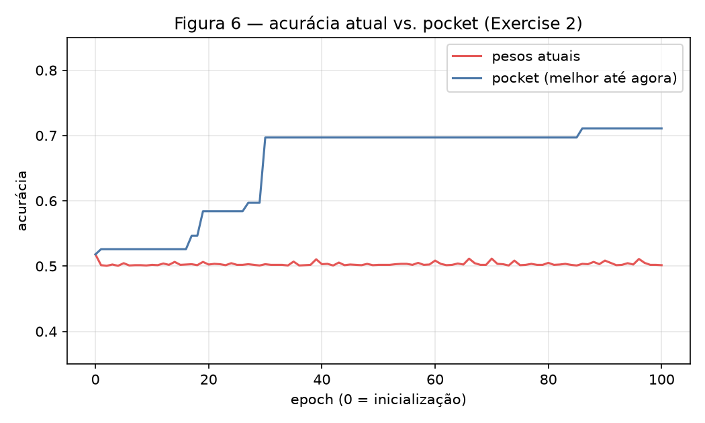

# 2. Perceptron

!!! abstract "Enunciado"

    [Exercises → Perceptron (2026.2)](https://insper.github.io/ann-dl/2026.2/exercises/perceptron/){:target='_blank'}

Semente única `rng = np.random.default_rng(42)` para amostrar os dados **e**
inicializar $\mathbf{w}$. O perceptron é uma função `train`: predição
$\mathrm{step}(\mathbf{w}\cdot\mathbf{x}+b)$ com rótulos em $\{0,1\}$, sem
`scikit-learn`.

``` { .python .copy .select linenums='1' title="docs/exercises/perceptron/code/perceptron.py" }
--8<-- "docs/exercises/perceptron/code/perceptron.py"
```

## Exercise 1

### A — Generate the data

Duas gaussianas 2D, 1000 pontos cada:

- classe 0: $\boldsymbol{\mu}=[1{,}5,\,1{,}5]$, $\Sigma=0{,}5\,I$
- classe 1: $\boldsymbol{\mu}=[5,\,5]$, $\Sigma=0{,}5\,I$

Os centros estão longe em relação ao desvio, então uma reta basta.


/// caption
**Figura 1** — 2000 pontos; as nuvens quase não se tocam.
///

### B — Implement the perceptron

Predição $\hat y=\mathrm{step}(\mathbf{w}\cdot\mathbf{x}+b)$,
$\mathrm{step}(z)=1$ se $z\ge 0$. Atualização só no erro
$(y-\hat y)\in\{-1,0,+1\}$:

$$
\mathbf{w}\leftarrow\mathbf{w}+\eta(y-\hat y)\mathbf{x},\qquad
b\leftarrow b+\eta(y-\hat y).
$$

$\mathbf{w}$ sai de `rng.normal(0, 0.01, size=2)`, $b=0$, $\eta=0{,}01$,
no máximo 100 epochs. Para quando um epoch inteiro não atualiza.

### C — Train and measure

Com $\eta=0{,}01$:

- $\mathbf{w}=[0{,}050497,\,0{,}028872]$, $b=-0{,}250000$
- **26** epochs até zero atualizações
- acurácia final **1{,}000000** (nenhum ponto errado na Figura 2)


/// caption
**Figura 2** — reta $\mathbf{w}\cdot\mathbf{x}+b=0$ sobre os dados
($\eta=0{,}01$). Sem marcadores de erro: acurácia 100%.
///


/// caption
**Figura 3** — a curva sobe com zigue-zague (os dados estão na ordem
classe 0, depois classe 1) e trava em 1{,}0 no epoch 26.
///

### D — Analysis

1. Dados separáveis convergem porque cada erro empurra a reta para o lado
   certo e, depois de um ponto, **não volta a ser erro**. O número de
   atualizações por epoch cai até zero — é exatamente o critério de parada.
   O zigue-zague da Figura 3 é a ordem das amostras: um epoch inteiro de
   classe 0 desloca a reta, depois a classe 1 puxa de volta, até caberem
   as duas nuvens.

2. Mesma inicialização $\mathbf{w}=[0{,}002532,\,0{,}008952]$, $b=0$, só
   $\eta=1{,}0$: **37** epochs, acurácia **1{,}000000**,
   $\mathbf{w}=[5{,}870616,\,3{,}359239]$, $b=-31$. Direções
   $\mathbf{w}/\lVert\mathbf{w}\rVert$:

   | $\eta$ | direção unitária |
   |--------|------------------|
   | 0,01 | $[0{,}868123,\,0{,}496349]$ |
   | 1,0 | $[0{,}867950,\,0{,}496652]$ |

   O cosseno entre elas é $1{,}000$. Os dois chegam a 100%, com magnitude
   bem diferente: cada passo $\eta\mathbf{x}$ compete com um $\mathbf{w}$
   inicial de tamanho $\approx 0{,}01$. Com $\eta=1$ o primeiro erro já
   desloca $\mathbf{w}$ por $\lVert\mathbf{x}\rVert\sim 3$–$6$, então a
   sequência de correções muda (26 vs. 37 epochs) mesmo com a reta final
   quase paralela. $\eta$ controla o **tamanho do passo em relação ao
   arranque**, não um “ângulo mágico” da fronteira.

3. Se $\mathbf{w}=\mathbf{0}$, $b=0$, depois de $t$ atualizações

   $$
   \mathbf{w}(\eta)=\eta\sum_{k=1}^{t} e_k\mathbf{x}_k,\qquad
   b(\eta)=\eta\sum_{k=1}^{t} e_k,\qquad e_k=y_k-\hat y_k.
   $$

   A predição $\mathrm{step}(\mathbf{w}\cdot\mathbf{x}+b)$ com $\eta>0$
   não depende de $\eta$:

   $$
   \mathrm{step}\!\left(\eta\sum e_k\mathbf{x}_k\cdot\mathbf{x}+\eta\sum e_k\right)
   =\mathrm{step}\!\left(\sum e_k\mathbf{x}_k\cdot\mathbf{x}+\sum e_k\right).
   $$

   A sequência de erros é a mesma para $\eta_1$ e $\eta_2$, logo
   $\mathbf{w}(\eta_2)=(\eta_2/\eta_1)\mathbf{w}(\eta_1)$ e
   $b(\eta_2)=(\eta_2/\eta_1)b(\eta_1)$. A reta $\mathbf{w}\cdot\mathbf{x}+b=0$
   e o número de epochs não mudam. Por isso o enunciado proíbe o zero:
   só com um $\mathbf{w}$ inicial de verdade $\eta$ altera o caminho.

## Exercise 2

### A — Generate the data

Classe 0: $\boldsymbol{\mu}=[3,\,3]$, $\Sigma=1{,}5\,I$.
Classe 1: $\boldsymbol{\mu}=[4,\,4]$, $\Sigma=1{,}5\,I$.
Mesmos 1000+1000 pontos, mesmos `rng`.


/// caption
**Figura 4** — centros próximos e variância triplicada: não há reta que
zere os erros.
///

### B — Train, keeping the best weights

O `train` do Exercise 1, $\eta=0{,}01$, teto de 100 epochs, mais o
**pocket**: depois de cada atualização, se a acurácia no conjunto inteiro
melhorou, copia $(\mathbf{w},b)$.

| | $\mathbf{w}$ | $b$ | acurácia |
|---|---|---:|---:|
| final (epoch 100) | $[0{,}054484,\,0{,}048043]$ | $-0{,}070000$ | **0,5015** |
| pocket (epoch 86) | $[0{,}010664,\,0{,}008727]$ | $-0{,}070000$ | **0,7110** |

O final perto de 50% é o resultado certo: chute de uma classe só.

### C — Figures


/// caption
**Figura 5** — linha preta (pocket) corta a nuvem; a vermelha (final)
fica *ao lado* de quase todos os pontos. Círculos marcam erros do pocket.
///


/// caption
**Figura 6** — a curva vermelha oscila em $\approx 50\%$; a azul (pocket)
sobe até $0{,}711$ e não desce.
///

### D — Analysis

1. A melhor reta neste emaranhado anda perto de 73%; o pocket chegou a
   **71,1%**. O final (**50,15%**) não. Na Figura 5 a reta final está
   deslocada para fora da nuvem: quase todos os $\mathbf{x}$ caem do
   mesmo lado, daí o 50%. Por quê o loop deixa ela lá? Cada erro faz
   $\Delta b=\pm\eta=\pm 0{,}01$ e
   $\Delta\mathbf{w}=\pm\eta\mathbf{x}$ com $\lVert\mathbf{x}\rVert\approx 5{,}11$,
   então $\lVert\Delta\mathbf{w}\rVert\approx 0{,}051$ — o peso se
   mexe ~5 vezes mais que o bias por erro, mas o *deslocamento da
   reta* (o intercepto $b/\lVert\mathbf{w}\rVert$) oscila o tempo todo
   porque os erros das duas classes nunca acabam. Depois de 100 epochs
   o último estado é um ponto qualquer desse vai-e-vem, frequentemente
   uma reta que já saiu da nuvem. O pocket congela o melhor recorte,
   que ainda atravessa o overlap.

2. A Figura 3 **assenta** em 1{,}0; a Figura 6 **não**. O teorema de
   convergência do perceptron garante zero erros em tempo finito **se**
   existe um hiperplano que separa as classes. Este conjunto viola essa
   hipótese: as gaussianas se atravessam, então sempre existe amostra
   com $(y-\hat y)\neq 0$ e o loop não para.

3. Mais epochs não resolvem: o critério “nenhuma atualização” nunca
   ocorre, e o iterado final continua um passeio aleatório. $\eta$ menor
   só encolhe cada $\eta(y-\hat y)\mathbf{x}$; a sequência de erros
   permanece infinita. O pocket já é a resposta possível *dentro* do
   modelo linear — o teto ~73% não é falta de treino, é geometria.

## Results summary

| # | Quantity | Value |
|---|----------|-------|
| 1 | Exercise 1 — final $\mathbf{w}$ and $b$ | $[0{,}050497,\,0{,}028872]$, $b=-0{,}250000$ |
| 2 | Exercise 1 — epochs to convergence | 26 |
| 3 | Exercise 1 — final accuracy | 1,000000 |
| 4 | Exercise 1 — epochs and final accuracy with $\eta=1{,}0$ | 37 epochs, 1,000000 |
| 5 | Exercise 2 — final $\mathbf{w}$ and $b$ | $[0{,}054484,\,0{,}048043]$, $b=-0{,}070000$ |
| 6 | Exercise 2 — accuracy of the final weights | 0,5015 |
| 7 | Exercise 2 — accuracy of the pocket weights | 0,7110 |
| 8 | Exercise 2 — epoch at which the pocket best occurred | 86 |

## Discussão

O perceptron não “falha” no Exercise 2 por bug: ele faz exatamente o que
a regra manda, e a regra não tem ótimo global. Sem o pocket, o número
que você reportaria seria o 50% enganoso da última epoch.

## Conclusão

Linearmente separável $\Rightarrow$ a regra de erro zera as atualizações.
Sobreposto $\Rightarrow$ as atualizações nunca param, a acurácia corrente
não significa nada, e só o melhor-até-agora (pocket) é um classificador
linear honesto.
